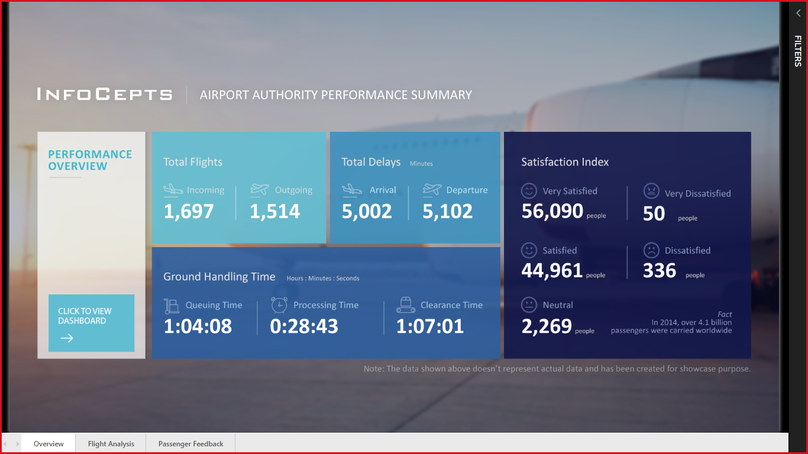
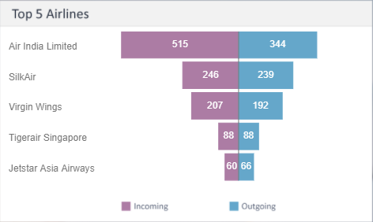
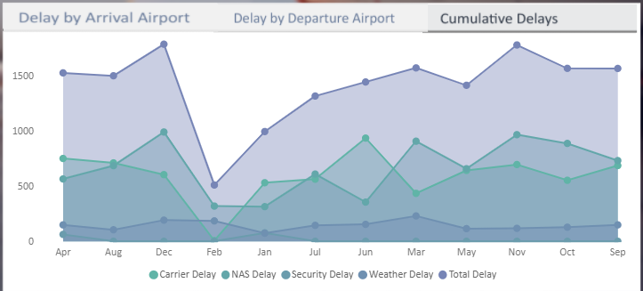

# Assignment 1

Improve Understanding Of Visualisation Techniques

Go to the PowerBI Gallery https://community.powerbi.com/t5/Data-Stories-Gallery/bd-p/DataStoriesGallery and choosing an interesting visualisation:
- Find three interesting facts or insights
- What makes this an effective visualisation?
- What would you like to change?

# The Visualisation

I picked this visualisation of [performance of an airport authority](https://community.powerbi.com/t5/Data-Stories-Gallery/Airport-Authority-Performance-Summary/td-p/628963).

# Interesting Insights

## 1
I initially inferred that there were 171 grounded Air India aircraft (difference between inbound and outbond...but then I realise that it doesn't declare which airport. It's also not clear over what period the data was collected)

Or not - this must be the number of flight *"in the air"* right now.

This might be a limitation of static data for a dashboard that would be dynamic; or better labelling.

## 2
NAS (National Aerospace System - I guess) is the biggest cause of delays...but it would be nice to know for certain what NAS is

Although, I think this would work better as a stacked line.

## 3
Suspicious of the completely 50%/50% gender split of passengers.

# What Makes This An Effective Visualisation

I'm not sure that it is.

Some of the basic data is very simply presented, especially in the tiles on the front page. However some of the drill-downs and filters feel clunky and are confusing as they change multiple tiles, in not entirely expected ways.

# What Would I Change

I would think harder about the kinds of jobs an airport admin would do with this data, and the kind of analysis an insight they would need. I did not feel that it gave me any insights without having to think about what the data was telling me (compared with the animations on Dr... TED talk that smack you round the face)

It's not clear what is clickable or not clickable. There are some tiles where I would like to drill down (e.g. Flight Type on the Flight Analysis page)

I feel that some slightly better explanations of the data being presented would benefit the users

I would add more drill down...
- number of flights by duration to estimated departure
- number of flights by duration to estimated landing
- for late estimated landings...what would the security clearnace times need to be to bring the duration back to normal
- It would be great to see live position of flights on the map (like FR24!)
- Overlay weather or NAS data to see if we can predict delays on the inbound flights

